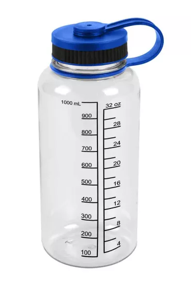

# Introduction

## What Is a Fungible Queue?

Fungible Queues are at the heart of the OceanBook protocol, providing a means of telling Market Makers, or what we call Liquidity Setters, when their order is filled.

They are developed with the quality of fungilibity in mind, meaning that all the assets being placed onto the same queue are treated in an equal manner.

When things are of a homogenous nature in a smart contract, there is no need for us to read multiple pieces of data.

If we are aware of how much liquidity is available at a certain price on a token pair, there is no need to read each individual maker order.

This is what makes the concept of Fungible Queues unique in the space of decentralized applications.

In the end we only need a few pieces of information to have an operational Maker/Taker side:
- the exchange rate for the specific queue
- the total volume of maker orders
- the total volume of taker orders
## The Short and Simple Explanation

Let's imagine a 1L bottle of water which is marked every 100 mL.

* Alice has Mineral Water and wants Spring Water.

* Bob has Spring Water and wants Mineral Water.

* Both are willing to exchange 100 mL for 100 mL.

{: .center}

These steps must take place in the following order:

1. Alice puts the Mineral Water bottle from 0 mL to 100 mL.

2. Bob comes and takes the 100 mL of Mineral Water Alice placed.

3. At the same time, he will place his 100 mL of Spring Water in a second bottle.

4. Alice can then claim her 100 mL of Spring Water.

Alice is able to claim the output of her order fill since 100 mL of Spring Water was taken.

Since the exchange took place at a 1:1 rate, Alice will be able to claim 100 mL of Spring Water.

The smallest possible amount Bob can take will depend of the precision of our liquid measurements.

If that amount is 1 mL, there can be a maximum of 100 individual exchanges for Alice's 100 mL.

Each time the person taking Mineral Water will have to update how much was taken in total.

A bottle will hereafter be referred to as a `Page`, which is a collection of orders at the same price point.

## The More Detailed Technical Explanation

To understand the principal motivation behind Fungible Queues and why they work, let's look to message queue architecture from previous generations.

Apache Kafka was created by a team led by Jay Kreps, Jun Rao, and Neha Narkhede at LinkedIn in 2010. 

Kafka’s architecture was built with the ability to handle billions of individual events in mind with varying sizes.

To start working with Apache Kafka Queues one must understand the concepts of `Topics` and `Offsets`.

{: .center style="height:350px; width:900px;"}

In the above figure, a `Topic` is simply a log of events . In our case, each event represents an individual `Order`. Thus, `P0` through `P3` can each represent an `Order` each with differing sizes.

A `Topic` here can be equated to a `Page` in each `Book` contract. When you write a new event to the `Topic`, it always goes on the end. Each `Topic` maintains an `Offset` which will always tell which events have already been processed. This allows Kafka to obey the principle of `Exactly-Once Processing`. 

While we only have synchronous processing in the context of a blockchain, this concept of an `Offset` does allow us to tell `Producers`, otherwise known as `Market Makers` in the context of orderbooks, when their `Order` has been filled.

The `Offset` in the context of OceanBook simply plays the role of tracking how much volume has occurred on a given `Page` and relating that to the point where the `Market Maker` pushed their `Order` to the queue.

 
 
 

