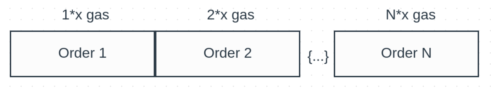

# Introduction

### **What is OceanBook?**

The OceanBook protocol is a peer-to-peer decentralized exchange which introduces efficient <em>price time priority</em> into the world of decentralized exchanges.

It is built for fully fungible ERC-20 token exchange on EVM-compatible blockchains and meant to function as an <em>on-chain limit order book</em>.

<em>OceanBook has three main components:</em>

1. OrderBook
    * an on-chain representation of the liquidity in each Page (see core concepts)
2. Matching engine
    * the smart contract code to first prioritze price and then time
3. Router
    * the means by which maker and taker orders will be sent to the appropriate `Book` contract

### **Mistakes of the Past: Where Decentralized Orderbooks Have Fallen Short**

There is one guiding principle which sets OceanBook apart from other on-chain orderbook protocols:

<em>For X amount of gas spent, a taker must receive Y liquidity.</em>
<br/>
<br/>
#### **Maker OTC by the Dai Foundation**

[Maker OTC](https://github.com/daifoundation/maker-otc) was an attempt at an on-chain orderbook with the following in its `README.md`:

```
Design Consideration

The protocol uses an on-chain order book and matching engine. The primary advantage
of such approach is that the liquidity is available for other smart contracts 
that can access it in one atomic ethereum transaction. The second advantage is
that the protocol is fully decentralized without any need for an operator.

Order book for each market is implemented as two double-linked sorted lists, one
for each side of the market. At any one time the list should be sorted.

The second important design choice is the use of the Escrow model for Makers - 
every order on the order book needs to be "backed up" by the liquidity that is
escrowed in the contract. Although such approach locks down liquidity, it 
guarantees zero-risk, instantenous settlement.
```
<br/>
The main downfalls of Maker OTC:

- Offer iteration is expensive
- Doubly linked list maintenance
- No correlated market with continuous liquidity
<br/>
<br/>

#### **The Liquidity Fragmentation Problem**
<br/>
Assume that accessing each order's liquidity involves 4 storage reads and 2 storage writes.

4 * SLOAD cost + 2 * SSTORE cost = 18,400 gas units

Accessing each order's liquidity will cost 18,400 gas units on storage alone.

A Uniswap v3 swap will comparitively be ~127,000 gas units at a single price tick.

<br/>

{: .center style=""}
<br/>
<br/>

Once we have accessed more than 3 orders we have already exceeded this gas cost.

Consider the base transaction fee is 21,000 gas units and 2 ERC-20 transfers is 60,000 gas units.

21,000 + 60,000 + 18,400 * 3 = 136,200 gas units (107% of Uniswap v3 swap)
<br/>
<br/>
#### **Non-Deterministic Behavior**
Each offer has a fragmentation of the liquidity at a given price.

Instead of aggregating all the orders at a given price, we have to do `N` loads.

This `N` value could be unbounded and thus we encounter non-deterministic behavior.

*Note: markets could be disrupted by extreme liquidity fragmentation (i.e. many small orders).*

If we have no minimum order size, this can easily explode taker gas costs.

All it would take is the placement of thousands of small offers.

###<em>Maker OTC Conclusion:
The taker is not guaranteed to spend X gas for Y liquidity.</em>
<br/>
<br/>
#### **1inch Limit Order Protocol by the 1inch Labs**

The 1inch Limit Order Protocol is vastly different in design in that the limit order book is stored off-chain.

This section will also address the majority of Orderbook DEXes, which are currently off-chain due to the benefit of free order placement as well as the difficulty of maintaining contract state.

```
Contract allows users to place limit orders, that later could be filled on-chain. Limit order itself is a data structure created off-chain and signed according to EIP-712.
``` 

The main downfalls of 1inch Limit Order Protocol:

- Liquidity fragmentation between signed messages
- No escrow = no guaranteed liquidity
- Proprietary off-chain orderbook

Every signed message (i.e. a single limit order) will cost ~4000 gas if the message contains 64 bytes of data.

This means we again arrive at the issue of liquidity fragmentation where the amount of gas to get Y liquidity is unknown.

<br/>

{: .center style=""}
<br/>
<br/>

One of the downsides of off-chain orderbooks is the inability to bid a higher gas price to have one's transaction prioritized.

In addition, the internals of the off-chain orderbook are often proprietary, lacking transparency for users of the protocol.

This leads to the same business model as what currently exists for Robinhood.

"Robinhood Markets Inc. gets about 80% of its revenue from payment for order flow, selling its customers' orders to market makers like Citadel Securities to execute them."

Matt Levine from Bloomberg as well as many others in the space have written extensively on this, and ultimately if the data is explicitly public or explicitly private, no centralized party has proprietary access to user data.

Even if off-chain orderbooks are able to achieve a fair market structure, they lack on-chain composability, guaranteed settlement, and the general 'walled garden' nature of the blockchain.

### <em>1inch Limit Order Protocol Conclusion: 
The taker is not guaranteed to spend X gas for Y liquidity.</em>

### **How does the OceanBook protocol compare to a traditional centralized exchange orderbook?**

In comparison to a centralized exchange orderbook, on-chain limit order books cannot be equally expressive without encountering scalability issues.

This means that each `Book` contract will support limited precision with respect to the possible exchange rates between tokens.

The goal is to strictly limit the amount of on-chain storage access in order to maximize volume for the benefit of everyone.

In order to achieve this we must maximize deterministic behavior.

Traditionally this is why AMMs have worked quite well, and the same rules apply here.

This means accomodating for trades of different sizes separately as the amount of data each of these will load can be drastically different.

More details on how we solved for this will be released alongside the launch of public testnet.

<br/>
<br/>


