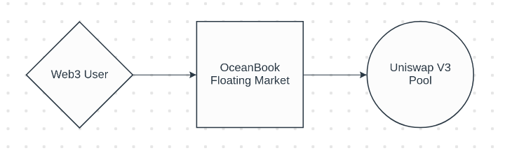

### **What will be the launch strategy?**

#### Implementation Details

The protocol will be implemented as a set of non-upgradable smart contracts to enable full permissionless access and protect against censorship resistance.

The smart contract code for the protocol will be open-sourced upon completion of multiple internal and external audits as well as a public testnet launch.

#### Onboarding Customer Protocols

The focus initially will be on protocols which have:

    - Numerous derivative tokens 
    - Liquidity fragmentation issues
    - High volatility such as options tokens

Areas of focus:

    - Foreign exchange (USDC, EUROC, etc.)
    - Options protocols (Opyn, Dopex, Ribbon Finance, etc.)
    - Derivatives protocols (Tokenized yield)
    - Tokenized vaults (ERC-4626)
    - Sub-DAO governance tokens

#### **Leveraging Existing Liquidity**

Additionally, due to the success of Uniswap V3 pools, OceanBook can leverage these on-chain oracles.

Checking the current `Tick` might be dangerous due to the ease of manipulating the price.

In order to accurately assess the current price of the Uniswap pool, we should use the most recent `Observation`.

<em>In this way Market Makers can undercut the AMM price and capture 100% of fees.</em>

{: .center style=""}

The process will be as such:
 
 

    1. Check TWAP price on Uniswap V3 Pool

    2. Fill user with desired liquidity up to TWAP

    3. Forward remaining liquidity to Uni V3 Pool
 
This will have aggregated price data across the last block.

As a result of having this data, our market price can be pinned relative to this data.

`0` would represent an exact match to the `Observation` from Uniswap V3 pool.

`-100` = 1 basis point (0.01%) decrease or a flat decrease.

`+100` = 1 basis point (0.01%) increase or a flat increase.

 
 
 