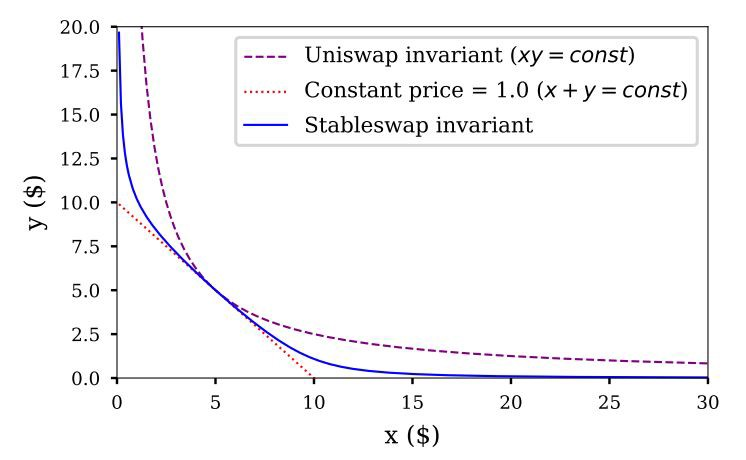

# Limitations of AMMs

Automated Market Makers (AMMs) are programs that follow some coded rules to determine and
adjust prices and volumes. Amongst those rules, the most common one is the constant-product
formula `x*y=k`.
<br/><br/>
Strengths:

* Passive Pricing
* Easy Liquidity Onboarding
* Continuous Liquidity
<br/><br/>

Weaknesses:

* Traders Inform Prices
* No Price Time Priority
* Bidirectional Risk for LPs
<br/>

>## **Slippage On Constant Function Market Makers**

<br/>
For traders exchange tokens on CFMMs (e.g. Uniswap v3), they are often subject to increasing slippage on larger trades.

The concept of slippage helps the Liquidity Provider avoid adverse selection, otherwise being on the wrong side of the trade when prices have a trend.

This helps the AMM keep the assets in the pool in balanced quantities and avoid divergent loss, otherwise known as impermanent loss.

This `slippage` is derived on the variance in the token reserves and is ultimately a passive pricing model to predict what price the liquidity provider should exchange at.
<br/><br/>
{: .center style=""}
<br/><br/>
When this slippage exceeds the price on another liquidity source (e.g. a centralized exchange), arbitrageurs
will bring the price on the AMM pool up to par.

What this demonstrates is that passive pricing from Automated Market Makers cannot surpass the efficiency of active pricing from a Central Limit Order Book. The scalability issues of the blockchain are what prevent this limitation from being surpassed.

>### **Slippage Solutions Within OceanBook**

The OceanBook Protocol enables market makers to undercut the current market price and receive fees accordingly.

This can happen in namely two ways:
```
1. Directional LPing
2. Priority Queueing
```

Using either of these methods will result in the ability to offer lower prices than traditional AMMs using the `x*y=k` formula.

These active liquidity providers can then receive a larger portion of the fees as a result of better pricing.

>## **Divergence in Prices Leading to Impermanent Loss**

The phenomenon of `impermanent loss` is a result of of the divergence in price between two assets in a liquidity pool.

The `loss` aspect relates to the temporarily loss of one of the assets due to volatility and the formula that governs the pool.

It is the difference between the profit from holding versus being in a liquidity position, either in USD or in percentage points.
<br/><br/>
{: .center style=""}
<br/><br/>