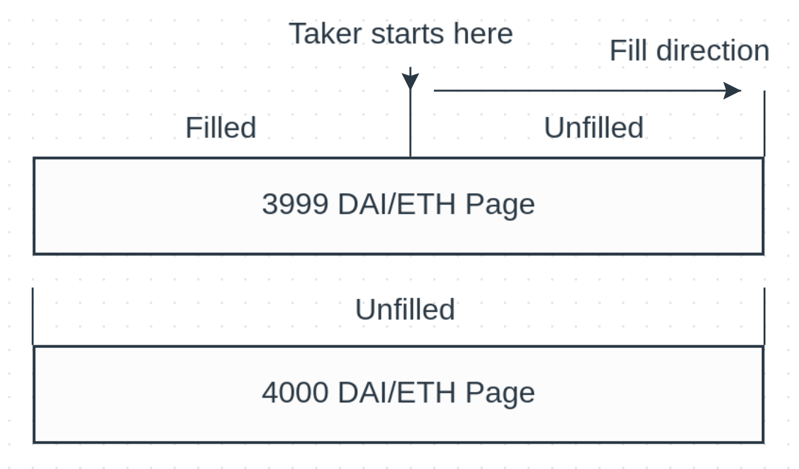

# QMM Core Concepts

Queued Market Makers differ from other decentralized exchange models in that they have a split buy and sell side.

Each `Book` contract is composed of the following:

- `Pages` sorted from lowest to highest price
    - one set for `token0` -> `token1`
    - one set for `token1` -> `token0`
- A set of `Orders`
    - each order is mapped to a `Page`

Here is a visual representation of that:

{: .center style=""}

From the `Taker` perspective, the `Book` will start filling from the lowest priced `Page`.

Here that is the 3999 DAI `Page`, which is first checked for liquidity present.

If there is not enough present in the first `Page`, the 4000 DAI `Page` will be accessed as well.

The `Book` will continue filling the user until their price or quantity limit is reached.

As each `Page` offset is updated, `Maker` orders will be claimable previous to this offset.

A `Page` is a `Fungible Queue` which contains the following items:
<br/>
<br/>
```
    - Price
        - This is used to determine exchange rate between `Makers` and `Takers`

    - Volume counter
        - In the smart contracts, this will be referred to as `currentOffset`
        - This is used to track which `Maker` orders have been filled
        - When `Makers` go to claim and/or replace their order,
          this value will be checked
            - Example: `currentOffset` is halfway between `start` and `end`
                       of `Maker` order and therefore 50% of their order will
                       be claimable along with fees.

    - Next page
        - The identifier for the next lowest-priced page
        
    - Previous page
        - The identifier for the previous lowest-priced page

    - Cancel list
        - Cancels function as someone stepping out of the queue
        - These are checked for on each `Taker` order
        - More details on how these are handled will be released upon
          public testnet launch
        - Current estimated costs: ~60,000 gas (47% of Uniswap v3 swap)
```
<br/>
<br/>
<br/>