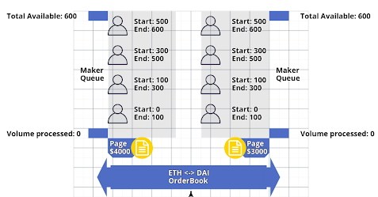

# Queued Market Making

A `Queued Market Maker` is a decentralized exchange structure wherein `Fungible Queues` are used to achieve <em>price time priority</em>.

The `Fungible Queues`, or `Pages`, are ordered from lowest to highest price so Traders seeking to exchange can be filled up to their limit price.

Each `Page` has a collection of `Orders` linked to it.

{: .center style=""}

In the above figure, each person will represent a market maker order in a queue.

Alice has the first `Order` in the 4000 DAI : 1 ETH `Page` will starts at `0` and ends at `100`.he fi

Bob has the first `Order` in the 4000 DAI : 1 ETH `Page` will starts at `0` and ends at `100`.he fi

Since a page exists for 3000 DAI : 1 ETH, the volume counter for the 4000 DAI : 1 ETH page will remain `0` until
