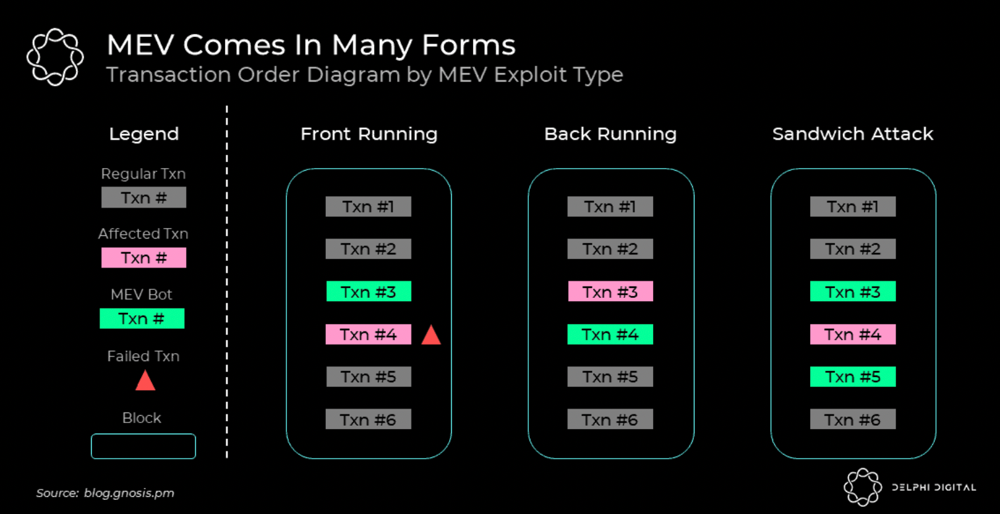

# MEV Related Risks
{: .center style=""}
 
 
# For traders

Traders are the ones who will either take liquidity off the books or place their liquidity up for exchange.

Depending on how the price changes after they submit their trade, making and taking are both possible.

### <em>Front Running</em>

In the case that a user's swap is front-run, they will ideally have a limit price set.

This limit price will be the highest price at which the user is willing to exchange their liquidity.

Thus, any price movement will not result in a failed transaction and the user can simply place their order in the `Book`.

When the price returns to where the user placed their `Order`, their `Order` will be filled and able to be claimed.

### <em>Back Running</em>

Back running is likely to occur when there is some "target transaction" the miner wishes to order themselves after.

One such popular case is in back running new token listings. More specifically, this would be after liquidity is posted to a `Book`.

A bot in such case might buy up all the liquidity available immediately upon a listing and attempt to relist at a higher price.

From the MEV Wiki:

"A typical backrunner will send many identical transactions, with gas price identical to that of the target transaction, sometimes from different accounts."

### <em>Sandwich Attacks</em>

Sandwich attacks involve an MEV attacker seeing that Alice wants to buy a specific token, `TokenA`. The miner then pushes the Token A price the bounds of Alice's allowable slippage.

Then, Alice's transaction will execute, pushing the price of `TokenA` higher. The miner will then sell the `TokenB` bought earlier at a higher price and thus profit.

In the case of Poolshark, this attack will still be possible as long as the miner is willing to sell alice `TokenB` at or below her limit price.

 
 
 