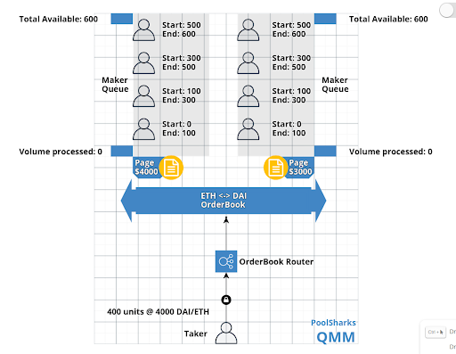

# Queued Market Making
## Queueing Orders
A `Queued Market Maker` is a decentralized exchange structure wherein `Fungible Queues` are used to achieve <em>price time priority</em>.

The `Fungible Queues`, or `Pages`, are ordered from lowest to highest price so `Takers` seeking to access liquidity from the exchange can be filled up to their limit price.

Each `Page` has a collection of `Orders` linked to it.

<br/>
{: .center style=""}
<br/>
<br/>
In the above figure, each person will represent a `Maker` order in a queue.

Based on a volume counter, referred to as `currentOffset`, we can determine which `Maker` orders have been filled.

At the start, let's ignore `Takers` so we can exclusively focus on how `Maker` orders enter the queue.

Alice has the first `Order` in the 4000 DAI : 1 ETH `Page` will starts at `0` and ends at `100`.

Bob has the first `Order` in the 3000 DAI : 1 ETH `Page` will starts at `0` and ends at `100`.

Carol now has three choices as a `Maker` with order size `100`:
- Enter the queue behind Alice in the 4000 DAI page from `100` to `200`
- Enter the queue behind Bob in the 3000 DAI page from `100` to `200`
- Enter the queue in a new `Page` at another DAI price from `0` to `100`

If Carol creates a `Page` for less than 3000 DAI : 1 ETH, her liquidity will receive priority over Alice and Bob when `Takers` fill orders.

Since a page exists for 3000 DAI (i.e. a lower offer), the volume counter for the 4000 DAI page will remain `0` until all the orders from the 3000 DAI page are filled.

The benefit in this exchange model from the perspective of `Market Makers` can be summarized in a few key points:

```
1. Fees are NOT shared with liquidity providers that provide more liquidity 
   than is needed to fill Taker orders.
2. Since Makers are filled FIFO, they can claim their completed order
   immediately along with any fees generated from the order flow. This
   allows for subsidization of the next set of orders placed on the exchange.
3. In order for another Market Maker to front-run an existing Order, they must
   offer a lower price and take a loss on any liquidity provided.
```

<br/>
<br/>
<br/>