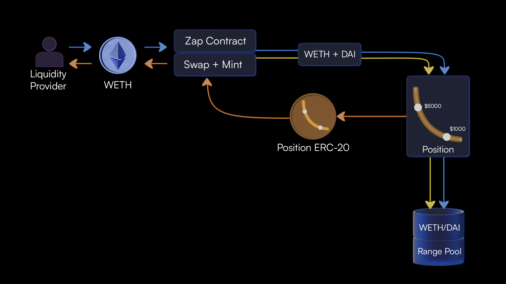

# Range Pools
<!-- Price Position with split buy/sell side -->
`Range Pools` are similar to what users have come to expect from bidirectional liquidity.

LPs can `range-bound` their liquidity, resulting in more liquidity being available near market price.

In the case of a stable pair, this increases the trading fees accrued from such a position.

The opportunity cost of price divergence for `range-bound liquidity` is greater compared to `full-range liquidity`, and such impermanent loss is intended to be mitigated with the use of [`Cover Pools`](cover-pools)

Range Pools here have one unique feature improving composability with other DeFi protocols: `Default Ranges`. 

{: .center style="width:85%"}

To put it simply, Range Pools contain many small constant function curves between each price point, commmonly referred to as a `Tick`. 

Each of the smaller price ranges will have reserves based on liquidity active within that `Tick`. 

Within each `Tick`, the pool functions exactly the same as what users have come to know from Constant Function Market Makers.

Mechanism to understand:
```
- Choosing a Range Bound
- Claiming Position Liquidity
- Claiming Fees Accrued
```
## Choosing a Range Bound

The below table is a recommendation for `range-bound` liquidity based on our team's analysis:

|                 |     Volatile     |        Pegged        |       Anchored      |
| --------------- | ---------------- | -------------------- | ------------------- |
| **High Volume** | Full/Broad Range |  Medium Range        | Narrow Range        |
| **Mid  Volume** | Full/Broad Range |  Medium Range        | Narrow Range        |
| **Low  Volume** | Full/Broad Range |  Medium/Narrow Range | Narrow/Medium Range |           |

### Volatile Pairs

The volatile category applies to most pairs where a project pairs ETH or a stablecoin against their native token.

Provided the liquidity is `range-bound`, the magnitude of impermanent loss will be greater. For a `range-bound` position on a low volume pair, it’s very unlikely that the gains from trading fees will exceed the loss from impermanent loss.

Further, `range-bounding` liquidity on a volatile pair runs the risk of your position falling out of range. If your position falls out of range, you’ll need to rebalance. Rebalancing costs you in swap fees, slippage and gas.

To cover the costs of rebalancing one's liquidity position, we recommend a `Cover` position to cover impermanent loss with directional liquidity profits.

### Pegged Pairs

Pegged pairs, though not completely eliminating the risk of impermanent loss, often result in minimal IL. For lower volume pairs, LPs might want to increase the range slightly on each side.

### Anchored Pairs

Anchored in this context describes asset pairs that move predictably and steadily in price relative to one another.

WETH and rETH from `Rocket Pool` is a great example here. If rETH returns 10% annually relative to WETH, we could deploy a liquidity mining program on a narrow, concentrated range of liquidity, adding 10% to the upside as a buffer. This position would likely remain in range for a full year maintaining a high degree of capital efficiency — without any rebalance required.

## Claiming Position Liquidity

Depending on the current price of the pool, the user will be able to withdraw their position accordingly:

* `price` < user's `lower` tick: 100% of user liquidity will be in `token0`
* `price` > user's `upper` tick: 100% of user liquidity will be in `token1`
* `price` > user's `lower` tick AND `price` < user's `upper` tick: a mix of the user's liquidity will be both in `token0` and `token1`

## Claiming Fees Accrued

The way in which `Range Pools` track how much of the user's position has been filled is by using the value `feeGrowthGlobal`. Depending on where the current tick is will determine what liquidity is withdrawn from the pool.

Fee accounting is tracked with the `feeGrowthGlobal0` and `feeGrowthGlobal1` values present on the `upper` and `lower` tick representing the user's Position. Global fees generated represent 1 unit of liquidity, so to get the fees belonging to a single `Position`, we will multiply by that `Position`'s liquidity amount. 

Fees accumulated outside of a price range are tracked when a tick is crossed. This allows us to simply calculate fees accumulated below the lower tick and then fees calculated above the upper tick.

`feeGrowthGlobal0` and `feeGrowthGlobal1` are on a per liquidity unit basis, so this value is simply multiplied by the amount of liquidity contained in a Position to determine the fees owed to that specific Position.


<br/><br/><br/>