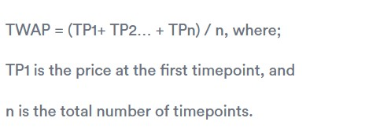

# Glossary 

## Automated Market Maker

Automated Market Makers are a type of Decentralized Exchange that employs a fixed algorithm for providing liquidity.

See more [here](https://www.gemini.com/cryptopedia/amm-what-are-automated-market-makers).

## Bidirectional Automated Market Maker

Liquidity pools which facilitate both buying and selling on a token pair.

> Example: Uniswap, Curve Finance

## Directional Automated Market Maker

Liquidity pools which facilitate only buying or only selling on a token pair.

> Example: Poolshark

## DEX

Decentralized Exchanges (DEX) are a peer-to-peer marketplace where users can trade assets in a non-custodial manner without the need for an intermediary overseeing the custody and transfer of assets.

## Dutch Auction

A dutch auction operates in the reverse fashion in comparision to what many have come to know as an English auction. Dutch auctions are started at a high price and then over time the items are discounted by the auctioneer until all assets are sold. Dutch auctions have come to be used often in decentralized finance by lending protocols liquidating collateral by auctioning it off. One such example of this is [MakerDAO](https://docs.makerdao.com/keepers/the-auctions-of-the-maker-protocol) using this for liquidating collateral.

The benefit of dutch auctions is that they allow for partial sales throughout the auction as opposed to an English. They also disclose minimal amounts of information as after a bid is made the asset is sold so as a bidder there is less ability to tell who you are bidding against. This means that it is not possible for a bidder to purposely outbid another, a bidder must know what their acceptable price is before the auction starts, this maximizes the amount returned in auctions as it is first come first serve.

Dutch auctions are also used by Opium Protocol and were featured by Paradigm in a series of writings focusing on dutch auctions with additional logic.

## Full-Range

A Full-Range is a descriptive term for when users provide liquidity to an AMM spanning the entire possible range.

> Example: Uniswap v2 LP positions

## Limit Order Book

A limit order book is a record of outstanding limit orders maintained by an exchange. A limit order is a type of order to buy or sell an asset at a specific price or better. When a limit order for an asset is entered, it is kept on record by the limit order book.

## Liquidity Pool

A smart contract containing a collection of digital assets accumulated to enable trading and/or yield oppertunities.

## Maker

A maker is a user who provides asset upfront to facilitate trades with takers on an exchange.

## Price Priority

This is the description of a structure that prioritizes trades based off the lowest price when buying or the highest price when selling. This ensures that whether an asset is being bought or sold the party looking to market buy receives the best deal for them first.

## Taker

A taker is a user who trades with pre-existing assets provided by makers on an exchange.

## Trading Pair

A trading pair is the name of the pairing of assets. Typically pairs are named asset x - asset y and the number symbolizing price is presented at amount of token x / per token y.

eg. ETH-DAI means the price of ETH in DAI

https://www.gemini.com/cryptopedia/what-are-cryptocurrency-pairs

## Price Tick

A price tick is an individual discrete value that represents a part of a virtual constant product curve. To help visualize this think about changing a continous constant product curve into a discrete curve by separating it into individual price points. The individual price points are the ticks A price tick also determines the accuracy of liquidity provision as if a virtual constant product curve 

Tick spacing is known the size of each price tick. Each price tick has it's own constrained constant product curve which . The tick spacing is determined by the fee tier of the pool by multiplying the fee tier by two. 

The tick are given numerical values starting at 0. To find what price value is attributed tick a value is attributed to and their width is given by the formula:

price = ( 1 + z ) ^ n 
where z is the tick spacing in decimal form 
and n is the numerical value for the price tick

eg. if you are trying to provide liquidity at a price of 1000 token x per token y, and the fee tier is 0.01%

z = fee tier * 2
z = 0.0001 * 2
z = 0.0002

price = ( 1 + z ) ^ n 
1000 = (1 + 0.0002) ^ n
n = ln(1000) / ln(1.0002)
n ≈ 34542

The above values subbed back in to the original formula show that you would be providing liquidity at the price point of 999.95 token x per token y. This is only an average of course as tick 34542 exists as its own constant product curve.

## Time Weighted Average Price (TWAP)

A time weighted average price (TWAP) is the average price a token is traded at over a period of time. Below is an example of a common TWAP formula.

{: style="width:50%"}

Due to all transaction on a DEX being queryable on-chain a TWAP price can be calculated relatively simply by finding the timestamp and exchange rate for an asset over a certain period of time. Due to the ease of finding data and the calculation a TWAP price is seen as a simple way to create a price data source for a price oracle.

The length of the time period the exchange rates are recorded over and ease of price manipulation have a **negative relationship**. This means that the longer the time period is the harder manipulation is. The cost to finding a TWAP price over a longer time period is that the TWAP will be less reactive to price changes and thus less accurate over a shorter period of time. In summary for a given TWAP price relative to chosen the time period length the main dependant variables with a negative relationship are short term price accuracy and ease of manipulation.

## Fee Tier

A fee tier is the percentage fee that a taker must pay when swapping with a pool. Fee tiers determine the tick spacing as the fee tier is half the size of the each price tick. Foor more information please check [Price Ticks](#price-tick).

   