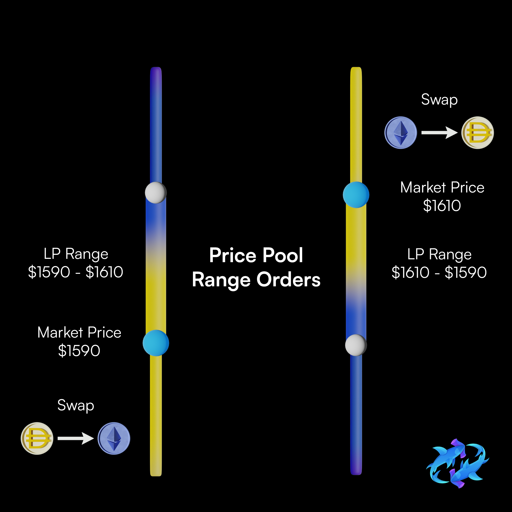

# Limit Pools

Limit Positions operate as a limit order consolidatidated to a invariant curve. The pool is used to collect the liquidity on a specific pair.</br>

The main difference is that there is a split buy and sell side. 
The best priced liquidity for each respective trading direction is aggregated to be accessed first.

This enables Limit Pools to enforce [**price priority**](/docs/overview/glossary/#price-priority).

</br>
{: .center style="width:85%"}
</br></br>

Limit Pools therefore allow users to undercut the current market price and receive prioritized execution for doing so.

In offloading a large position before a large market move, it would be ideal to slightly undercut the market price.

### **Limit Pool Use Cases**

</br>
> **<em>Use Case #1: Quick Exit/Entry</em>**
> </br></br>
> <em>Alice wants to sell ETH from 1998 to 1999.99 DAI per ETH.</em>
> </br>
> <em>The current price of ETH is 2000 DAI per ETH.</em>

</br>
For this `Limit` position:

* `lower` bound would be 1998
* `upper` bound would be 1999.99

This position would start offering up DAI to the market at a price of 1999 moving towards 1999.99 as their liquidity is filled.
If this is the best price on the market, traders will naturally gravitate towards the Limit Pool in order to source their liquidity.

It is key to have enough of a better price on the market to incentivise the volume to come and arbitrage vs the price offered by a Bidirectional AMM.

If the depth of the liquidity isn't deep enough a market order will move to the liquidity offered by an AMM due to the high depth. 

This is great for large traders who are unwilling to accept slippage and paying for trading fees on the market, as they can wait until their liquidity is prioritized in order to capture the exact execution price they desire. In addition due to being on the provider side the position will collect a premium (in the form of a trading fee) based on the fee tier of the order in the pool.

In this case the average price ETH is sold at by Limit Pool is xx.xx DAI per ETH. In addition to this if the fee tier of the pool is 0.3% then we can take the average price sold and multiply it by (1 + fee tier) to get the average price sold inclusive of the premium. 

In summary: In this example Alice is better off providing liquidity to a Limit Pool than swapping due to collecting the fee instead of paying it and having a predetermined execution price instead of being subject to slippage


Mechanism to understand:
```
- Choosing a Range Bound
- Claiming Position Rewards
```


### Taking Profit
<!-- add subtext below image -->
If you are seeking to take profit over some price range, Limit Pools are ideal given all the liquidity traded into your position will be retained. The `lower` and `upper` bound will mark the starting and ending price across which your position will trade from the input token to the output token.

Users looking to exit at a predetermined price can create a limit po


<br/><br/>