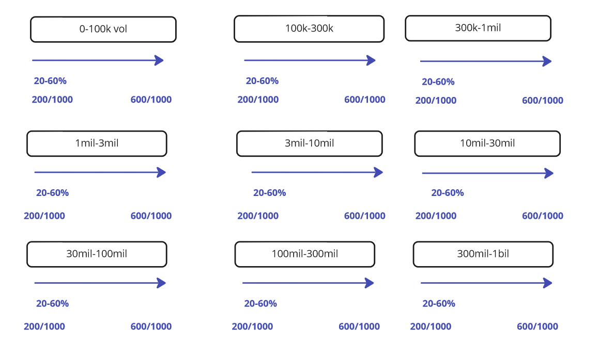

># **Centripetal Mining**

Centripetal mining is a concept originally engineered by the Poolshark team in order to incentivize volume on the platform.

More volume on the platform means the pool architecture is being utilized properly to provide the best market price at any given time.

The protocol will distribute out token incentives to the top X% of pools, X being based on which side of the current volume tier the protocol as a whole is in.

## Volume Tiers
{: style="width:100%"}

You found an easter egg!
    