# How to LP on Cover

## Minting a Position

    This is the basis for hedging risk. The equivalent of a stop loss.

A cover position consists of you choosing token A which you want to hedge price risk for (which you currently hold in your wallet) and token B to receive in the event one of the trigger prices for your stop loss are met, this token B is also used as the unit to price token B.

[x] **1.** Click ‘Connect Wallet’.

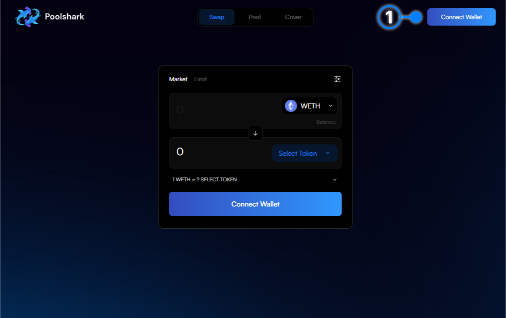{: style="width:100%"}

[x] **2.** Connect your wallet through the widget

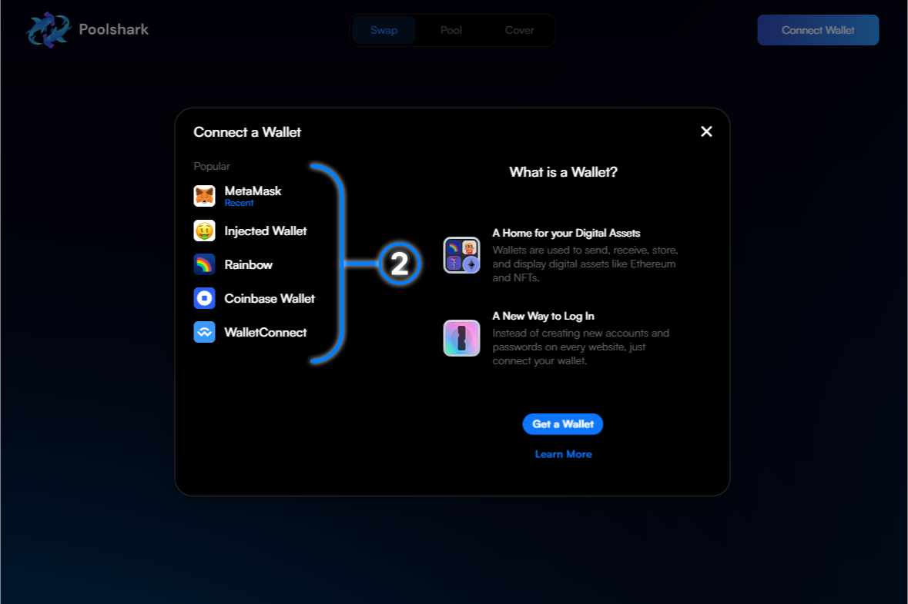{: style="width:100%"}

[x] **3.** Navigate to the “Cover” page

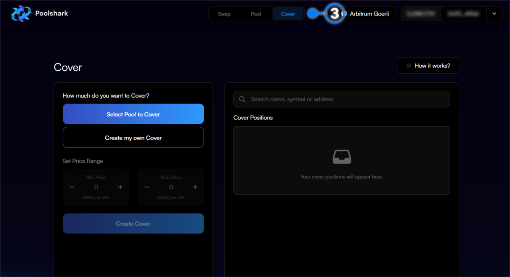{: style="width:100%"}

If you are looking to cover and existing range pool position please move to [Select Pool to Cover](#Select-Pool-to-Cover) otherwise scroll to [Create and Independent Cover Position](#create-an-independent-cover-position)

### Select Pool to Cover

[x] **4.** Click ‘ Select a Pool to Cover’

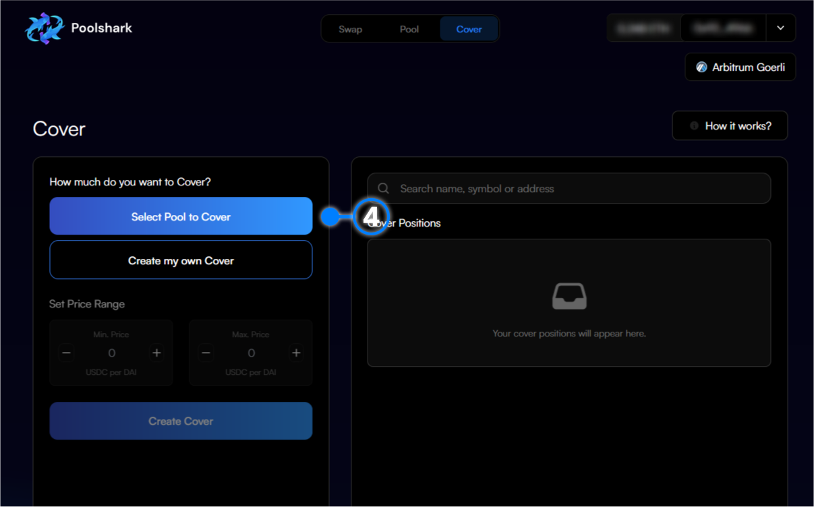{: style="width:100%"}

[x] **5.** Select one of your existing concentrated liquidity positions.

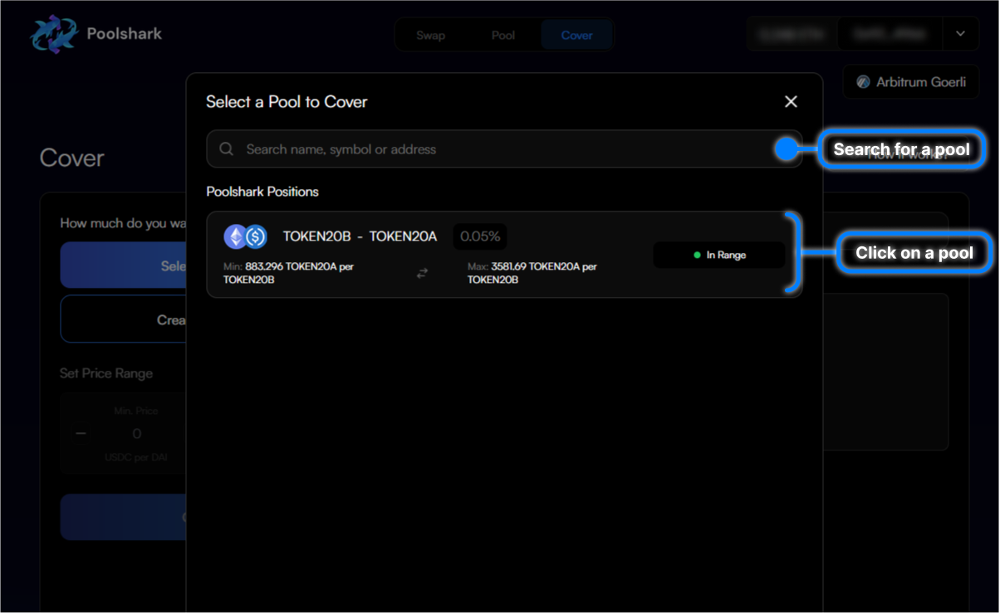{: style="width:100%"}

[x] **6.** Choose the amount of your position to cover

[x] **7.** Select the volatility tier for your position ([See Documentation for more info](https://docs.poolshark.fi/overview/glossary/#how-volatility-tiers-work))

[x] **8.** Choose the price range you wish to cover your liquidity over

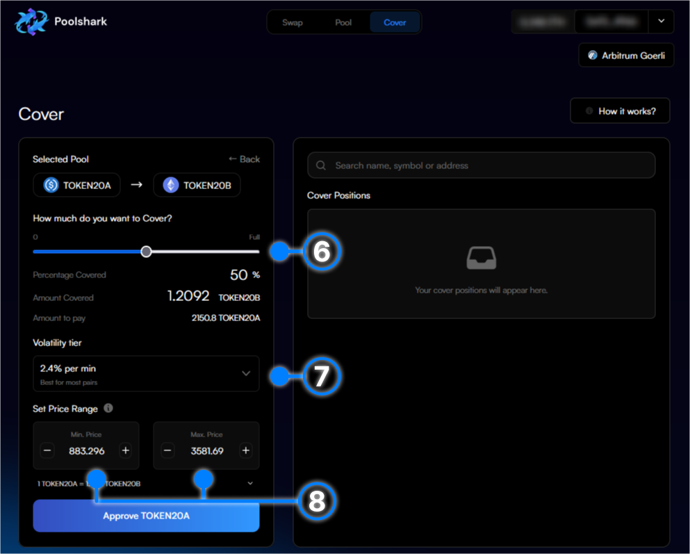{: style="width:100%"}

[x] **9.** Finally, click “Approve” and approve the movement of your tokens

[x] **10.** You will receive an approval signature request in your wallet. Press ‘Confirm’ in your wallet to confirm the approval

[x] **11.** Wait for the approval transaction to confirm

[x] **12.** Click ‘Create Cover’ to create the position

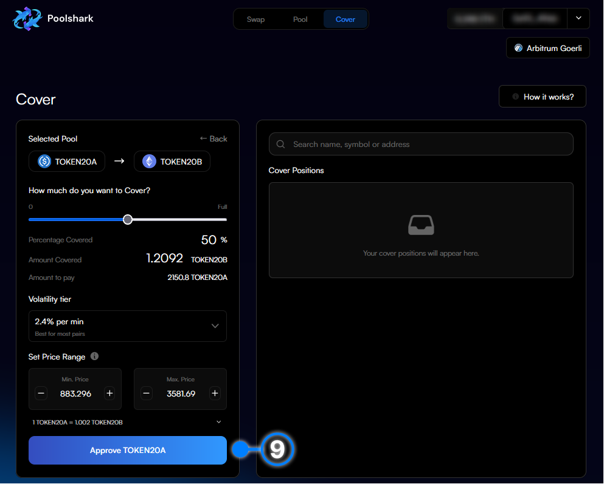{: style="width:100%"}

[x] **13.** You will receive a create cover position signature request in your wallet. Press ‘Confirm’ in your wallet to confirm the swap

[x] **14.** Wait for the transaction to be confirmed and executed in the next block

[x] **15.** Congratulations you have just created your Cover position on Poolshark! Click the pop-up to view on Arbiscan

### Create an Independent Cover Position

[x] **4.** Select “Create my own Cover”

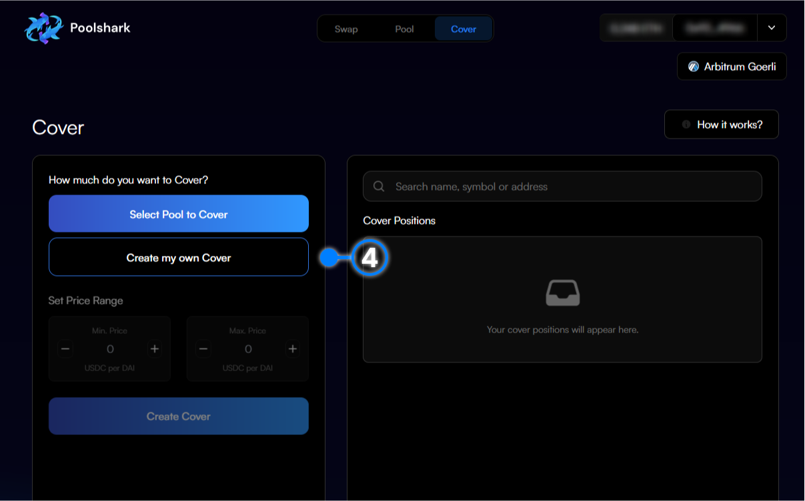{: style="width:100%"}

[x] **5.** Select the input token that you currently have in your wallet by clicking on the drop down

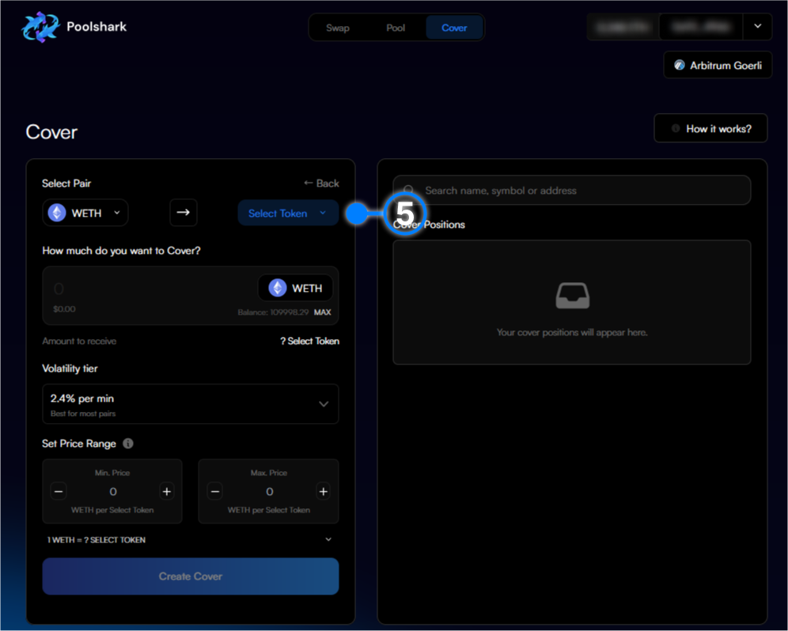{: style="width:100%"}

[x] **6.** Search for the input token within the list by typing or scrolling and click on it

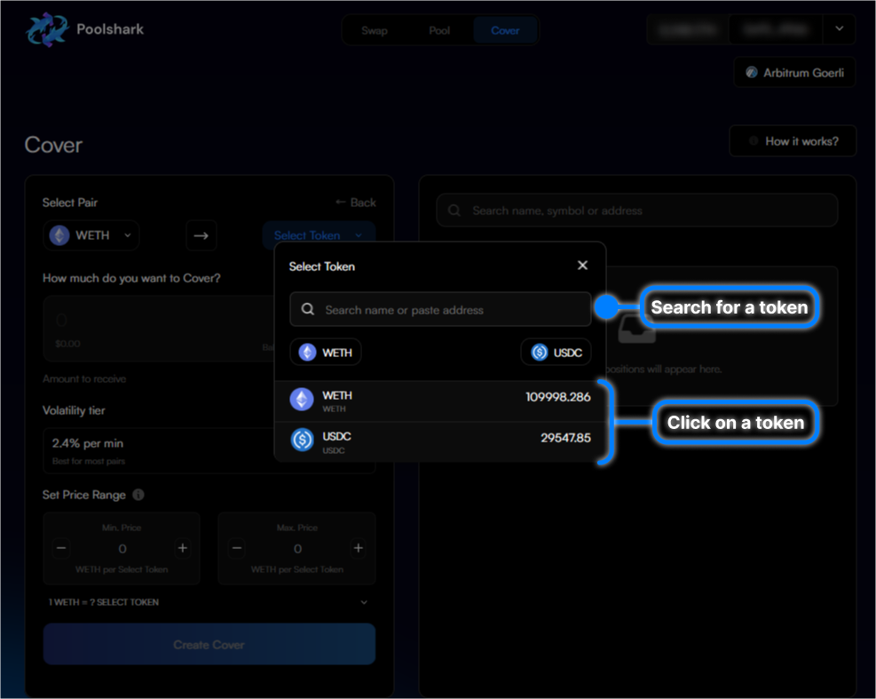{: style="width:100%"}

[x] **7.** Repeat steps 5 and 6 for the output token.

[x] **8.** Choose the amount of your input token to cover

[x] **9.** Select the volatility tier for your position (link to volatility tier documentation)

[x] **10.** Choose the price range you wish to cover your liquidity over

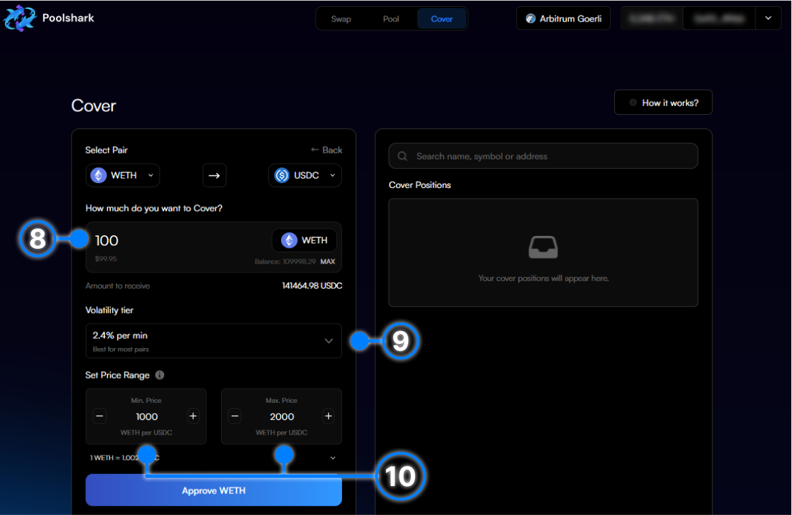{: style="width:100%"}

[x] **11.** Finally, click “Approve” to approve the spend of your tokens

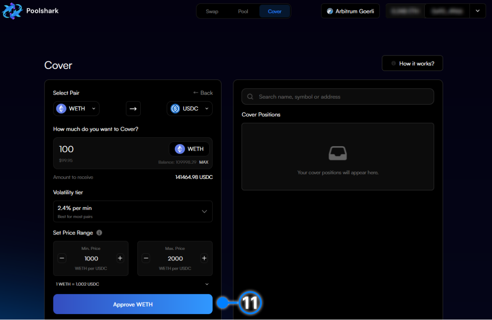{: style="width:100%"}

[x] **12.** You will receive an approval signature request in your wallet. Press ‘Confirm’ in your wallet to confirm the approval

[x] **13.** Wait for the approval transaction to confirm

[x] **14.** Click ‘Create Cover’ to create the position

[x] **15.** You will receive a create cover position signature request in your wallet. Press ‘Confirm’ in your wallet to confirm the swap

[x] **16.** Wait for the transaction to be confirmed and executed in the next block

[x] **17.** Congratulations you have just created your Cover position on Poolshark! Click the pop-up to view on Arbiscan

   