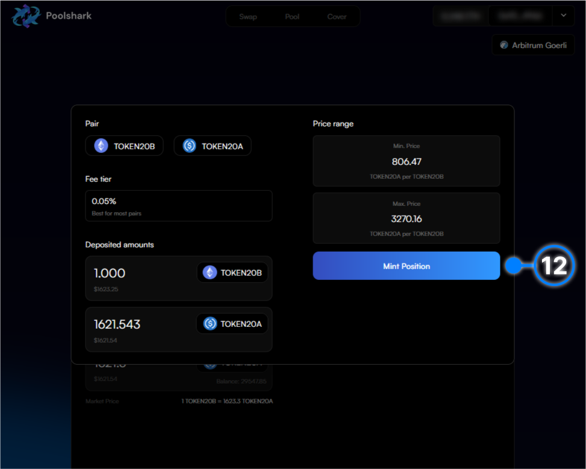

# How to LP on Range

## Minting a Position

    This is a typical bidirectional liquidity position ([See Documentation for more info](https://docs.poolshark.fi/overview/glossary/#bidirectional-automated-market-maker))

[x] **1.** Click ‘Connect Wallet’.

{: style="width:100%"}

[x] **2.** Connect your wallet through the widget

{: style="width:100%"}

[x] **3.** Navigate to the “Pool” page

[x] **4.** Select the token pair you want to provide liquidity on 

{: style="width:100%"}

[x] **5.** Alternatively select the ```token 0``` for input and output and a pool can be created

{: style="width:100%"}

[x] **6.** Find it within the token widget by clicking or searching

{: style="width:100%"}

[x] **7.** Repeat the same process for ```token 1``` by clicking selecting the second token

{: style="width:100%"}

[x] **8.** Select the fee tier ([See Documentation for more info](https://docs.poolshark.fi/overview/glossary/#fee-tier)) to provide liquidity at 

{: style="width:100%"}

[x] **9.** Input the range you would like to provide liquidity within (this will impact the number of tokens you input as it is based on where the current price is within the range)

[x] **10.** Enter the number of each token(s) you would like to provide within this range

{: style="width:100%"}

[x] **11.** Click "Preview" to make sure the fields are filled to your liking

{: style="width:100%"}

[x] **12.** Within the Preview pop-up click the button and it will open up allowances for each token if this is the first time creating a position with these tokens on Poolshark

{: style="width:100%"}

[x] **13.** Click confirm on the signature requests for the allowances within your wallet

[x] **14.** Click “Mint Position” and it will send an approval signature request to your connected wallet to create the position

[x] **15.** Click confirm on your wallet to sign the approval

[x] **16.** Wait for the transaction to confirm in the next block

[x] **17.** Congratulations you have just created your first range position on Poolshark! Click the pop-up to view on Arbiscan


<br><br><br>