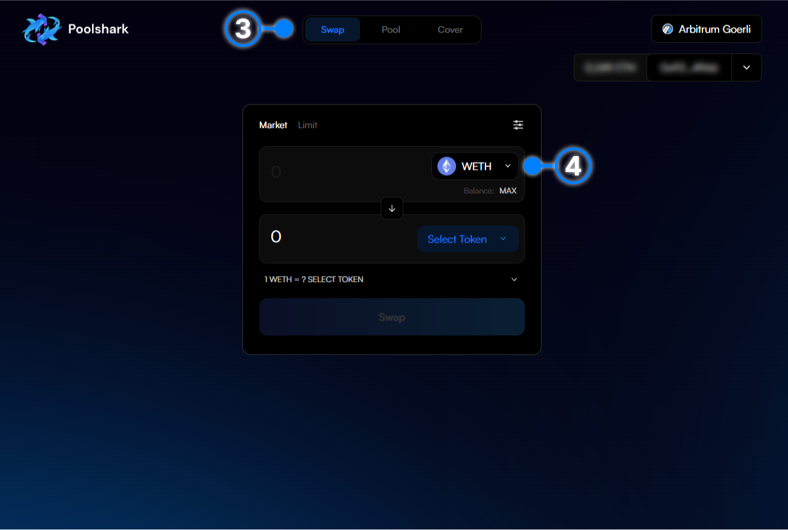
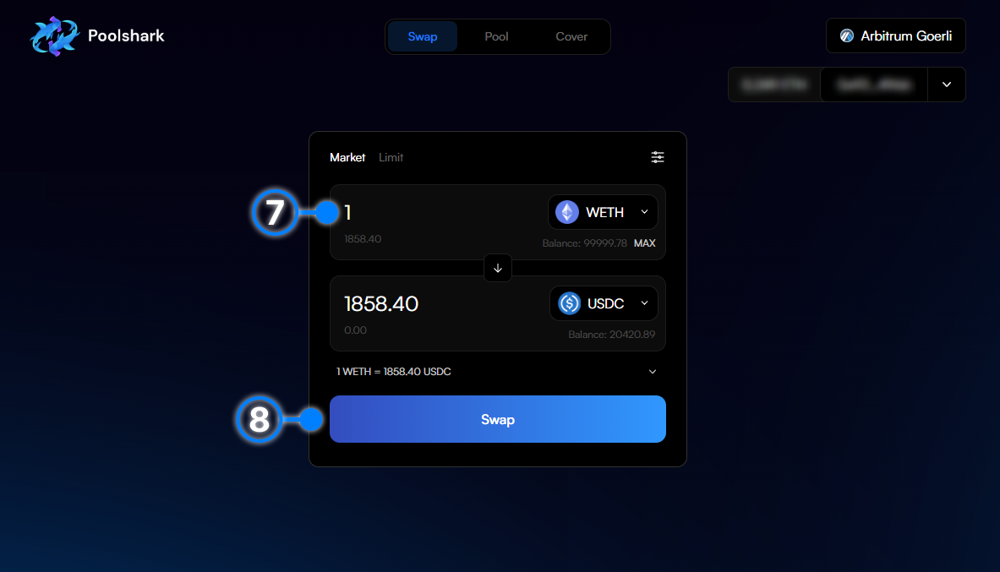

# How to Swap

    This is the basis for all trading. The equivalent of a market order. 

- [x] **1.** Click ‘Connect Wallet’.

{: style="width:100%"}

- [x] **2.** Connect your wallet through the widget.

{: style="width:100%"}

- [x] **3.** Navigate to the “Swap” page (It should be selected by default).

- [x] **4.** Select your desired input token by clicking on the drop down arrow.

{: style="width:100%"}

- [x] **5.** Find your desired token by clicking on the list or searching for it by name.

{: style="width:100%"}

- [x] **6.** Repeat the same process as Step 4 and 5 to select your desired output token.

{: style="width:100%"}

- [x] **7.** Enter the amount of the input token you wish to swap.

- [x] **8.** Cick “Swap” to Approve the router to swap your tokens (only applies if this has been your first time swapping this input token on Poolshark).

{: style="width:100%"}

- [x] **9.** You will receive a approval signature request in your wallet. Press ‘Confirm’ in your wallet to confirm the approval.

- [x] **10.** Wait for the approval transaction to confirm.

- [x] **11.** Click ‘Swap’ to execute the swap.

- [x] **12.** You will receive a swap signature request in your wallet. Press ‘Confirm’ in your wallet to confirm the swap.

- [x] **13.** Wait for the transaction to be confirmed and executed in the next block.

- [x] **14.** Congratulations you have just finished your first swap on Poolshark! Click the pop-up to view on Arbiscan.

{: style="width:100%"}

   