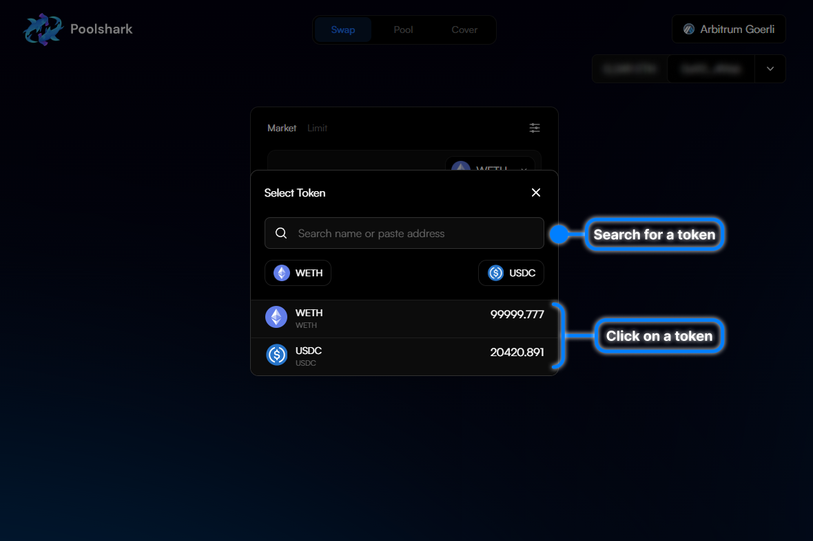
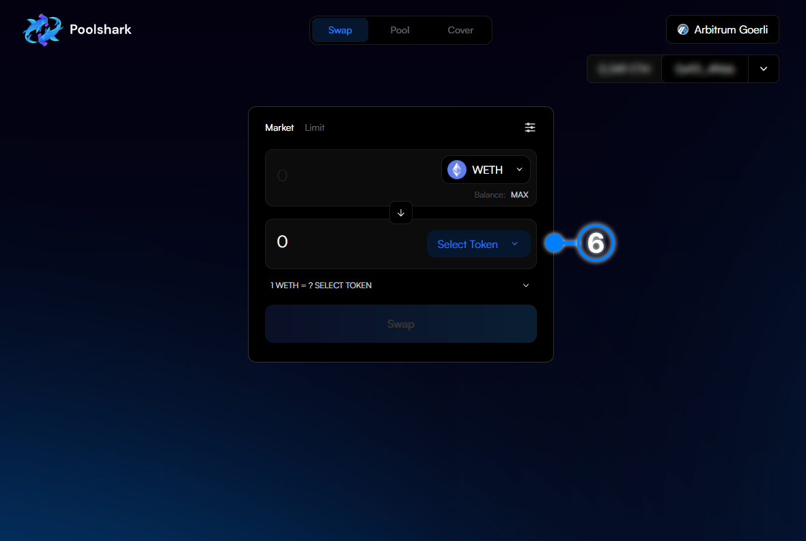

# How to Swap

## Here’s the process of executing a swap on Poolshark.

    This is the basis for all trading. The equivalent of a market order. 

A swap consists of you choosing a token you want receive and a token that you currently have in your wallet and executing a trade. As said above this requires you to have tokens in your wallet.

1 . Click ‘Connect Wallet’.

{: style="width:100%"}

2 . Connect your wallet through the widget

{: style="width:100%"}

3 . Navigate to the “Swap” page (It should be selected by default)

4 . Select your desired input token by clicking on the drop down arrow

{: style="width:100%"}

5 . Find your desired token by clicking on the list or searching for it by name

{: style="width:100%"}

6 . Repeat the same process as Step 4 and 5 to select your desired output token

{: style="width:100%"}

7 . Enter the amount of the input token you wish to swap

8 . Cick “Swap” to Approve the router to swap your tokens (only applies if this has been your first time swapping this input token on Poolshark)

{: style="width:100%"}

9 . You will receive a approval signature request in your wallet. Press ‘Confirm’ in your wallet to confirm the approval

10 . Wait for the approval transaction to confirm

11 . Click ‘Swap’ to execute the swap

12 . You will receive a swap signature request in your wallet. Press ‘Confirm’ in your wallet to confirm the swap

13 . Wait for the transaction to be confirmed and executed in the next block

14 . Congratulations you have just finished your first swap on Poolshark! Click the pop-up to view on Arbiscan

{: style="width:100%"}

   